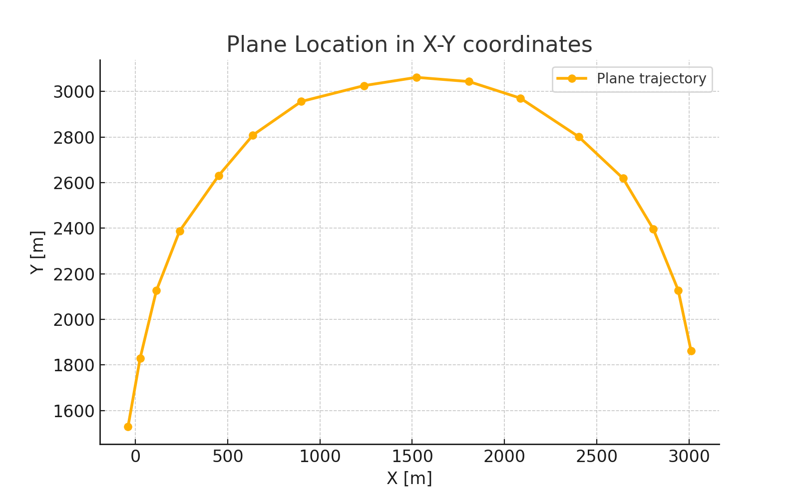
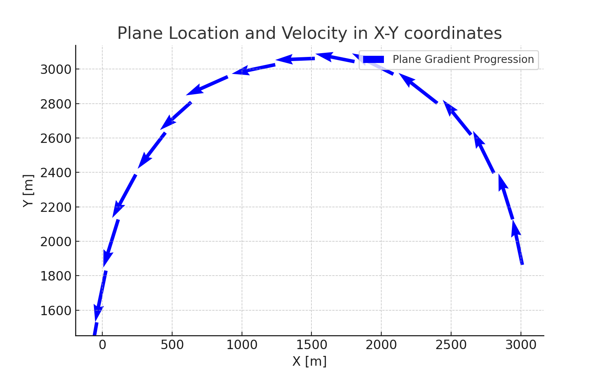
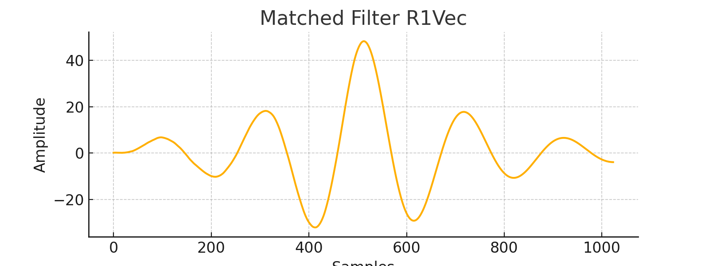
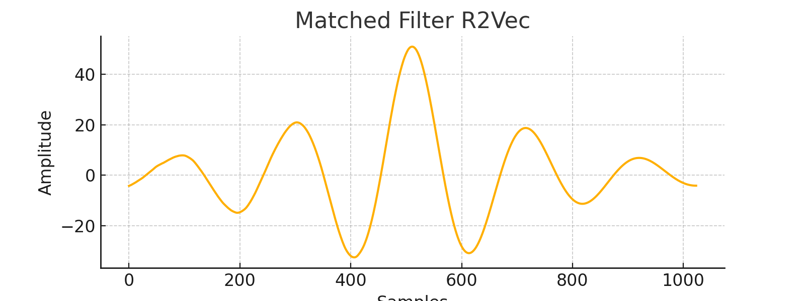
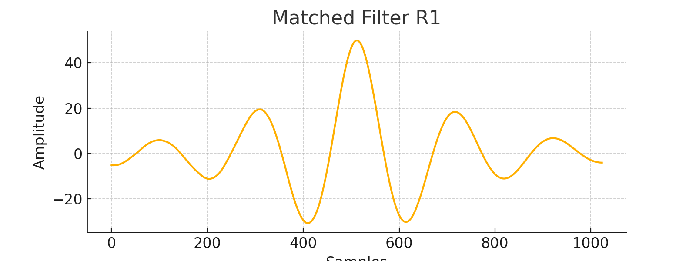
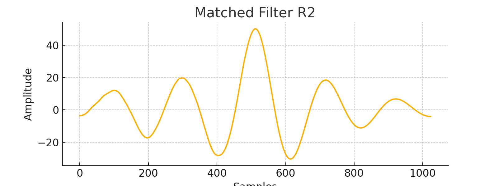
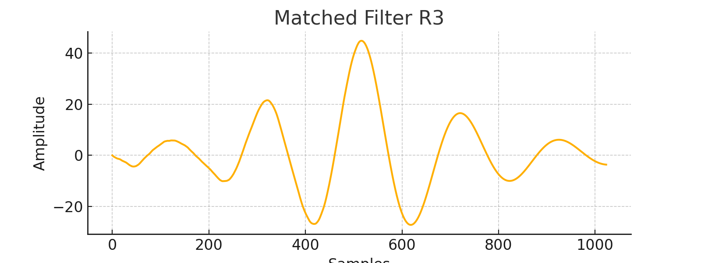

# Radar Signal Processing

Implementation of radar signal processing using matched filter, MAP delay estimation with thresholding, and 2D target localization.

## 📁 Structure
- `main.m` – MATLAB script covering Questions 1–3; includes matched filtering, thresholded MAP, and target localization.
- `.mat` files – input data:
  - `sigvec.mat`
  - `delayedvecs.mat`
  - `delayedvecsQ2.mat`
  - `radarreception.mat`
- `.png` images – visual results:
  - `trajectory.png` – estimated target path
  - `velocity_vectors.png` – speed vectors along the path
  - `matched_filter_r1vec.png`, `matched_filter_r2vec.png`
  - `matched_filter_r1.png`, `matched_filter_r2.png`, `matched_filter_r3.png`

## 🧠 Overview of `main.m`
- **Q1** – Basic delay estimation via matched filter; finds peak in noisy signals.
- **Q2** – MAP estimator with adaptive thresholding (δ < 1), estimating delays in multiple noisy instances.
- **Q3** – 2D localization: reshapes reception data into pulses, applies matched filter, estimates delays from two antennas, computes (x,y) positions, and plots velocity vectors.

Includes helper functions:
- `delay_estimation`
- `calculate_threshold`
- `radardetect`

## 📷 Results

### Plane trajectory  

### Velocity vectors over path  

### Matched filter results – Q1  
  

### Matched filter results – Q2  
  
  

## ✅ Usage
1. Clone repo
2. Ensure `.m` file and all `.mat` data files are in the same folder
3. Run `main.m` in MATLAB or Octave
4. View `.png` outputs and console messages
---
